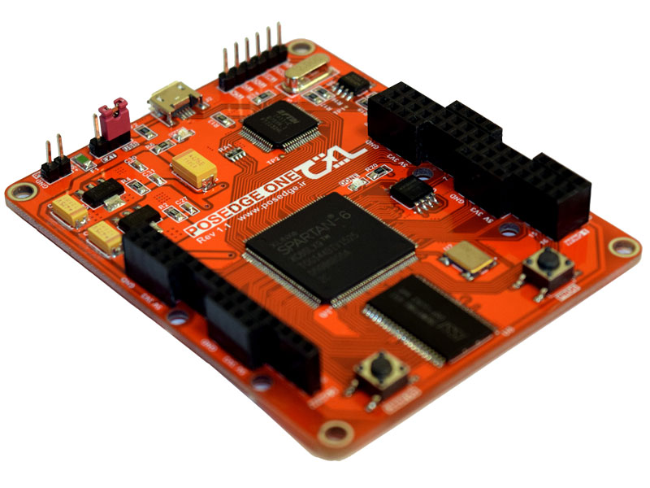
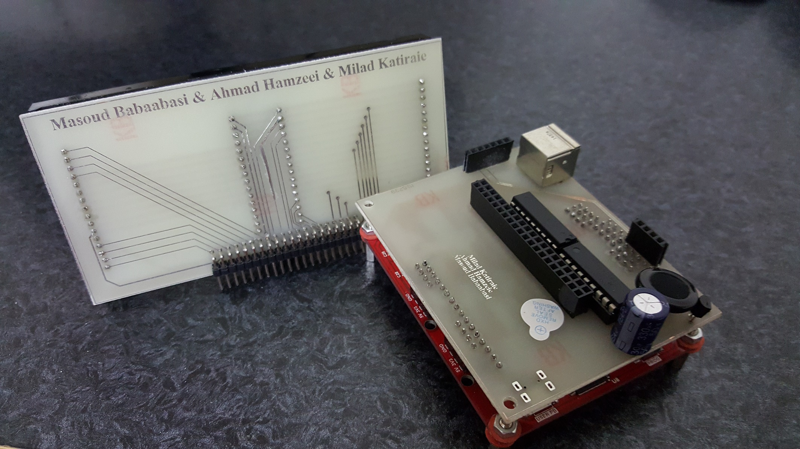
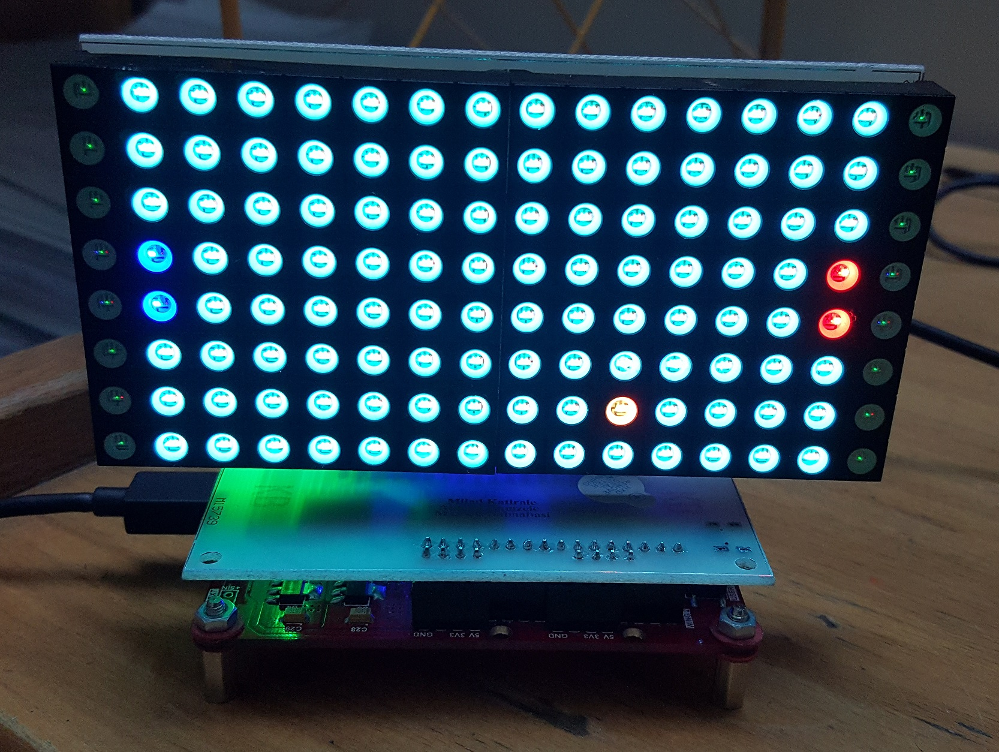

# RGB Dot Matrix FPGA driver
## Our Hardware Description Language Course Project
### Project Team Members:
- Masoud Babaabasi
- Ahmad Hamzeei
- Milad Katiraei
### About this project
In this project, our purpose was to drive two 8 by 8 RGB dot matrices and be able to show desired stuff on an 8 by 16 display. We used a Spartan6 development board called [POSEDGE ONE](https://posedge.ir/product/posedge-one/).

**Board specification**
- Xilinx Spartan6-LX9 chip 
- 4Mb SRAM
- USB2 with 10MB/s connection
- On board chip programmer via USB-jtag

For the project, we designed two PCBs. One of them which we called "wing PCB", consists of column and row drivers. The Dot matrix is common anode RGB which means that each row has 3 lines for each red, green and blue colors. Each Dot matrix has 24 lines for all the rows and 8 select lines. So our 16 by 8 display has 24 RGB lines and 16 select lines. On the wing PCB, there is one PS2 connector and one buzzer. 

The second PCB is a support PCB which holds the DOT matrices and stands perpendicular to the wing PCB. The PS2 connector is used for connection of a PS2 keyboard to FPGA and allows us to be able to receive input commands from the user. 

Dot matrices refresh modules are implemented in the Verilog language. A frame buffer is implemented using Spartan6 internal SRAM. For controlling the display and manipulation of the frame buffer, a CPU core called MicroBlaze is utilized. This CPU allowed us to write C/C++ code, which for demonstration we wrote a Ping Pong game for our display.

